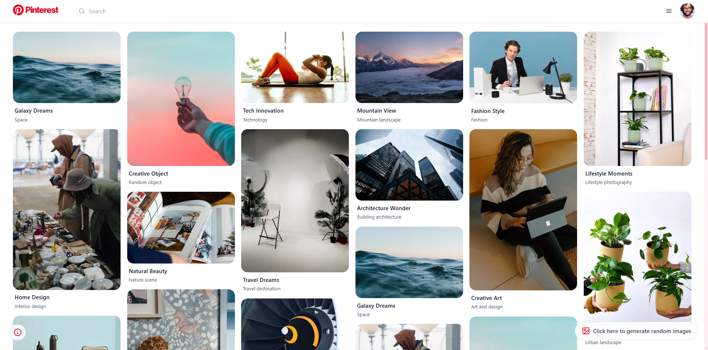
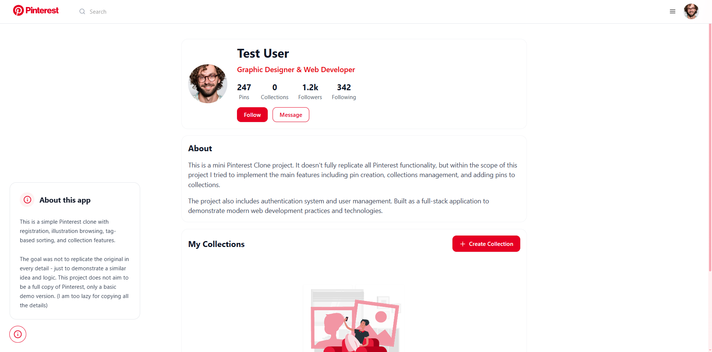
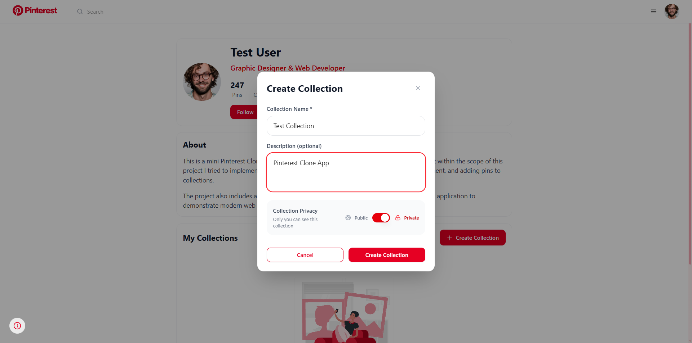
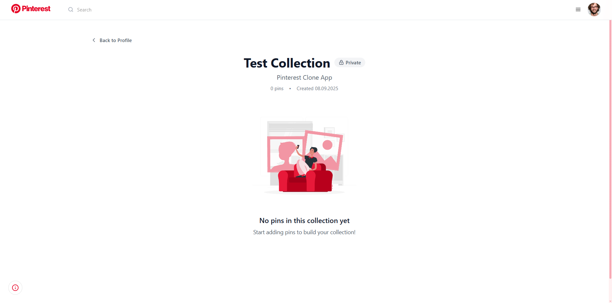
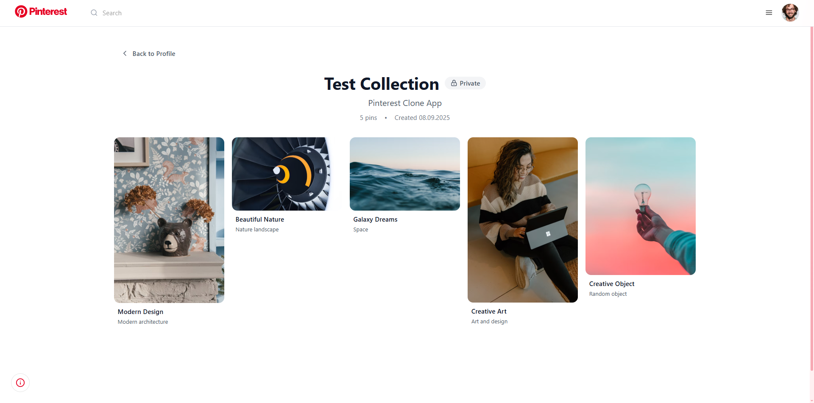

# Pinterest Clone

A full-stack Pinterest clone built with modern technologies. This project includes pin creation, collections management, user authentication, and a responsive Pinterest-style grid layout.

## 🚀 Technologies Used

### Frontend
- **Next.js 14** - React framework with App Router
- **TypeScript** - Type safety and better development experience
- **Tailwind CSS** - Utility-first CSS framework
- **TanStack Query** - Data fetching and state management
- **Framer Motion** - Smooth animations
- **React Hot Toast** - Beautiful notifications

### Backend
- **Go** - High-performance backend API
- **PostgreSQL** - Robust relational database
- **SQLC** - Type-safe SQL code generation
- **Chi Router** - Lightweight HTTP router
- **Session-based Authentication** - Secure user sessions

## 📸 Screenshots

### Main Feed


### User Profile & Collections


### Collection View


### Pin Creation & Management


### Authentication & User Interface


## ✨ Features

- 🔐 **User Authentication** - Secure login and registration
- 📌 **Pin Management** - Create, view, and organize pins
- 📁 **Collections** - Create public/private collections
- 🎨 **Pinterest-style Grid** - Responsive masonry layout
- 🖼️ **Image Modal** - Full-screen image viewing
- 📱 **Responsive Design** - Works on all device sizes
- ⚡ **Real-time Updates** - Instant data synchronization
- 🔒 **Privacy Controls** - Public and private collection options

## 🛠️ Installation & Setup

### Prerequisites
- Node.js 18+
- Go 1.21+
- PostgreSQL 15+

### Backend Setup
```bash
cd pinterest-clone-backend
go mod tidy
go run main.go
```

### Frontend Setup
```bash
cd pinterest-clone-frontend
npm install
npm run dev
```

### Database Setup
1. Create PostgreSQL database
2. Run migrations in `db/migration/` folder
3. Configure database connection in backend

**Note:** This is a portfolio project demonstrating full-stack development skills with modern technologies.
